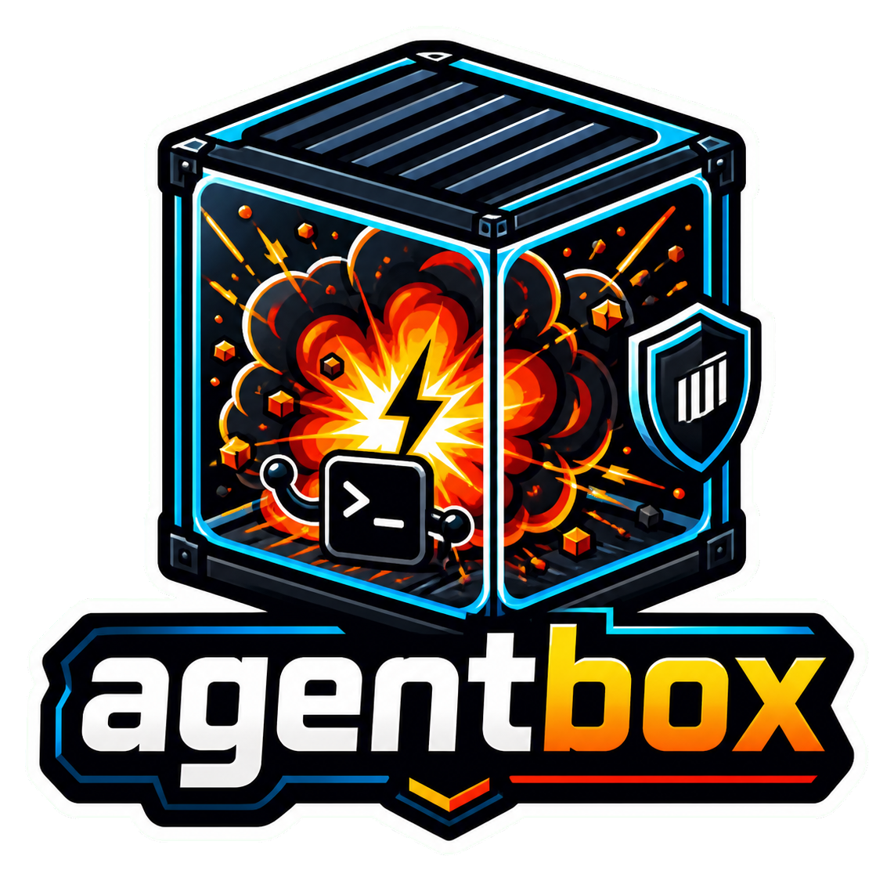
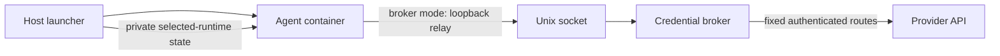

<p align="center">
  
  <br />
  <!-- repo-tagline:start -->
  <strong>⚡ Full autonomy. Explicit boundaries 🛡️</strong>
  <!-- repo-tagline:end -->
</p>

agentbox runs Claude Code or Codex with full autonomy inside an isolated Docker container. The coding agent can work without permission prompts inside the sandbox, while sensitive host paths, git credentials, and system files stay outside the container boundary.

Use it from any project directory when you want an agent to move quickly with Docker-backed filesystem, network, process, and mount controls.

## Install

Requires Docker installed and running, plus Git, curl, and Perl on the host. On macOS, Docker Desktop is the standard setup.

```bash
curl -fsSL https://raw.githubusercontent.com/tsilva/agentbox/main/install.sh | bash -s -- --runtime claude
# Or: git clone https://github.com/tsilva/agentbox.git && cd agentbox
./install.sh --runtime codex
```

Installation prefers published images pinned by digest and verified with Cosign against this repository's release workflow identity. Prebuilt installation requires `jq` and `cosign` on the host. Until the first image release is published, a missing release index falls back to a local build of the selected agent. Network, signature, malformed-index, and image-pull failures stop installation.

```bash
./install.sh --runtime claude --prebuilt  # require a signed release
./install.sh --runtime codex --build     # explicitly build locally
./install.sh --runtime claude --python   # add Python, uv, and pinned pytest
```

The minimal Claude and Codex images include only the selected agent and common shell/Git/search tools. Python tooling is optional. A small separate broker image is also installed. Installing again preserves existing sessions and preferences; it does not uninstall or stop running containers.

For pinned base and agent inputs, `./install.sh --locked` accepts `AGENTBOX_BASE_IMAGE` with an `@sha256:` digest, `AGENTBOX_CLAUDE_CODE_VERSION`, `AGENTBOX_CLAUDE_CODE_SHA256`, `AGENTBOX_CODEX_RELEASE_TAG`, and `AGENTBOX_CODEX_SHA256`. Codex releases with a separate Code Mode host also require `AGENTBOX_CODEX_CODE_MODE_SHA256`; the installer verifies and installs that matching companion. Apt resolution and the optional Python installation's release-age cutoff are not fully frozen by this option.

Reload your shell, or run `export PATH="$HOME/.agentbox/bin:$PATH"`, then:

```bash
cd /path/to/project
agentbox init                   # choose agent, access, mounts, and limits; approve locally
agentbox                        # launch with the saved project configuration
agentbox init                   # review or change the existing setup
agentbox inspect                # explain effective grants without reading auth
agentbox doctor                 # diagnose Docker, image, tools, and auth sources
```

`init` needs `jq` and an interactive terminal. It checks Docker and the selected image, displays the complete access plan, and asks before saving `.agentbox.json` and this machine's permission approval. It checks authentication only after approval and gives the selected agent's login instructions when needed. Cancelling or invalid settings leave the existing config unchanged. Install the chosen runtime before initializing it; `init` does not install or switch images automatically.

Inside a Git checkout, setup and launch commands use the repository root, including when invoked from a subdirectory. Outside Git, they use the current directory. A bare `agentbox` without a config points you to `agentbox init`; explicit launches and legacy profiles remain supported.

Direct authentication supports host Claude/Codex login or the selected agent's API key (`ANTHROPIC_API_KEY` / `OPENAI_API_KEY`). Broker mode requires an API key and does not use subscription login.

## Commands

```bash
agentbox init                         # configure this project and approve its permissions
agentbox                              # saved runtime, default profile, and access settings
agentbox review                       # override the saved mode with read-only host mounts
agentbox edit                         # override the saved mode with writable editing
agentbox --direct                      # override saved broker access with direct access
agentbox offline shell                # no network, credentials, or host plugins
agentbox --codex -p "explain this code"
agentbox --claude -p "explain this code"
agentbox --codex --broker -p "run tests" # provider-only API-key access
agentbox review --broker               # read-only project and provider-only access
agentbox --codex --profile dev
agentbox --claude --dry-run             # print command without auth reads or state writes
agentbox --claude -- --help             # pass options directly to the agent
agentbox plugins refresh               # explicitly snapshot installed Claude plugins
agentbox --claude --plugins             # mount the snapshot read-only
agentbox trust --list
agentbox untrust
agentbox update                        # update the project-selected or preferred runtime
agentbox --claude update               # update Claude independently of Codex
agentbox --codex update                # update Codex independently of Claude
```

`review` protects host-backed files; it still permits outbound traffic in direct mode. `offline` also works through a profile with `network: "none"`; it always strips authentication, including for a trusted project. Online agent inference is unavailable offline.

Broker mode disables networking in the agent container. A loopback relay connects through a read-only Unix socket mount in a private Docker-managed tmpfs volume to a separate broker that holds the provider key and forwards only fixed provider routes. General web access, package downloads, and published ports are unavailable in this mode. Switching to direct mode grants broader network and credential access explicitly; broker failure never switches modes automatically.

For an optional workspace copy that you review before applying:

```bash
agentbox --codex --staged -p "refactor this module"
# Review the workspace path printed at exit, then:
agentbox apply session.<id>
```

Staging requires Python 3 on the host and a Git checkout. It copies tracked and unignored regular files, excluding `.git`, `.env*`, `.pem`, `.key`, and symlinks. The source checkout stays unchanged during the session. Apply rejects symlinks, protected files, and conflicts with changes made to the source since staging; it never commits. Staging cannot expose extra host mounts. Apply performs a full conflict preflight, then applies files individually; an I/O failure can leave a partially applied result. Inspect the retained workspace and source before retrying in that case.

Development commands from this repo:

```bash
./scripts/agentbox-dev.sh build              # build the Docker image
./scripts/agentbox-dev.sh install            # build and install the CLI
./scripts/agentbox-dev.sh kill               # stop running agentbox containers
./scripts/lint.sh                            # run shellcheck
./tests/smoke-test.sh                        # run basic local checks
./tests/security-regression.sh               # check docker run security flags
./tests/isolation-test.sh                    # check container isolation behavior
./tests/validation-test.sh                   # check config validation
./tests/version-check-test.sh                # check update-warning behavior
python3 tests/launcher-test.py                # auth, private state, verification, staging
./tests/launcher-docker-test.sh               # actual launcher and broker isolation
docker run --rm -i --network none --entrypoint python3 agentbox - < tests/provider-protocol-test.py
(cd broker && go test -race ./...)            # broker routes, keys, limits, failure behavior
```

## Configuration

`agentbox init` creates a shareable `.agentbox.json`:

```json
{
  "version": 1,
  "runtime": "codex",
  "default_profile": "dev",
  "profiles": {
    "dev": {
      "mode": "edit",
      "access": "direct",
      "mounts": [
        { "path": "/Volumes/Data/input", "readonly": true }
      ],
      "ports": [{ "host": 3000, "container": 3000 }],
      "network": "bridge",
      "cpu": "4",
      "memory": "8g",
      "pids_limit": 256
    }
  }
}
```

`version` must be `1`; `runtime` is `claude` or `codex`; `default_profile` must name an entry in `profiles`. Profile `mode` is `edit` (default), `review`, or `offline`. Profile `access` is `direct` (default) or `broker`. Broker access requires a provider API key and uses API billing; offline mode strips authentication and disables networking. Other profile fields are `mounts`, `ports`, `network`, `audit_log`, `cpu`, `memory`, `pids_limit`, `ulimit_nofile`, and `ulimit_fsize`.

`init` configures one profile, retains other profiles and existing advanced settings, and prompts for runtime, mode, access, resource limits, and extra mounts. Edit the JSON to add published ports or advanced limits, then review and approve the resulting permissions. Re-running `init` converts legacy files with profiles at the root into version `1` while preserving their profiles.

Selection order is command-line flags, project settings, then the global runtime preference/defaults. Use `--profile <name>` or `-P <name>` to override the saved profile; `--claude`/`--codex`, `edit`/`review`/`offline`, and `--direct`/`--broker` override their respective settings. `--readonly` always restricts mounts. Legacy files remain accepted; their offline profiles also require local trust when requesting extra mounts or ports. Multiple legacy profiles require an explicit selection in unattended or preview mode.

Project configuration stores preferences and requested access. Credentials stay outside the repository. Local approvals live under `~/.agentbox/trusted-projects` and `~/.agentbox/project-grants`. A cloned versioned config requires local approval, including for offline access. Interactive launches show the plan and request approval when identity, config, image, runtime, or effective permissions change. Unattended launches fail with an actionable error instead of prompting. `agentbox trust` explicitly approves the displayed current plan; `agentbox untrust` removes local approval. `inspect` and `--dry-run` remain free of authentication reads and state writes.

## Notes

- `jq` is required for `init` and whenever `.agentbox.json` exists. If it is missing, agentbox exits instead of ignoring profile security settings.
- Project paths and extra mounts must be absolute canonical paths without symlink hops, control characters, or `:` characters; use `pwd -P` if needed.
- The current project is mounted at the same canonical path inside the container. The `.git` directory is mounted read-only, and host git credentials are not available.
- Project identity records include path, filesystem identity, git identity, remote URL, and config digests. Versioned configs also require approval of the effective access plan. Approvals are local and cannot be supplied by a committed config.
- Each launch owns a private directory under `~/.agentbox/sessions/`. Selected-runtime credentials/config are copied only after the complete launch plan and project trust have been validated. Inactive runtime state is empty. Normal exit and interrupts remove transient state, retrying transient mount-detachment errors and reporting persistent cleanup failures. Crashes of the host or forced termination can leave private directories requiring manual removal. Runtime conversation history in these directories is ephemeral. Audit logs remain opt-in.
- Offline launches never copy host authentication. Broker launches put the provider key only in the separate broker's private mount; the agent gets a session capability that stops working when the broker exits.
- Claude plugins are absent by default. `agentbox plugins refresh` creates a versioned snapshot; `--plugins` opts into a read-only snapshot without copying it at every launch. Old snapshots are retained for active sessions and can be removed manually when no longer used.
- A project-local `.agentbox.Dockerfile` can add dependencies, but it is used only when the launch includes `--allow-project-dockerfile`. Treat that flag as full runtime trust because the project image can replace shells, libraries, and agent binaries.
- `entrypoint.sh` writes runtime sandbox-awareness files (`CLAUDE.md` for Claude and `AGENTS.md` for Codex) so the selected agent sees the active mounts, blocked paths, network mode, and resource limits.
- See [SECURITY.md](SECURITY.md) for the isolation model, known boundaries, and reporting instructions.

## Architecture



In broker mode the agent has `--network none`; the separate broker has outbound networking and no project mount. Direct mode mounts selected-runtime authentication and uses bridge networking. Both modes retain a non-root identity, dropped capabilities, seccomp, no-new-privileges, read-only root, and read-only Git metadata.

Maintainers publish signed ARM64/x86 images using **Actions → Release verified images** with an explicit release tag and agent versions. The workflow tests the launcher and isolation before publishing minimal/Python variants, signs multi-platform digests with its GitHub identity, and creates an immutable `images.json` release asset. This workflow must be run after these changes are committed; adding it does not publish images.

## License

[MIT](LICENSE)

## Secret scanning

GitHub Actions scans changed commits with the pinned Infisical CLI. New branches
and rewritten pushes scan the complete history reachable from the new head, even
when the previous commit is no longer available. Missing pull-request revisions
and scanner errors still fail the check. Reports publish only finding locations;
credentials and matched source content remain private.
