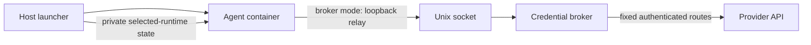

<p align="center">
  
  <br />
  <!-- repo-tagline:start -->
  <strong>⚡ Full autonomy. Explicit boundaries 🛡️</strong>
  <!-- repo-tagline:end -->
</p>

agentbox runs Claude Code or Codex without permission prompts inside a Docker container. Use it from your project directory to give an agent access to your code while controlling its filesystem, network, and resource limits.

## Install

Requires Docker running, Git, curl, Perl, and `jq`. Signed prebuilt images also require Cosign.

```bash
curl -fsSL https://raw.githubusercontent.com/tsilva/agentbox/main/install.sh | bash -s -- --runtime claude
```

Replace `claude` with `codex` to install Codex. The installer prefers verified prebuilt images and builds locally when no release index exists. See the [installation guide](docs/guide.md#installation-and-setup) for local builds and optional Python tools.

Reload your shell, then run:

```bash
cd /path/to/project
agentbox init    # configure access and approve the plan locally
agentbox         # launch with the saved settings
```

`init` requires an interactive terminal and saves `.agentbox.json` at the repository root. Authenticate with your host Claude/Codex login or the selected provider's API key.

## Commands

```bash
agentbox -p "explain this code"  # run a prompt and exit
agentbox review                 # read-only host mounts
agentbox offline shell          # shell without network or credentials
agentbox inspect                # show effective access without reading auth
agentbox doctor                 # diagnose Docker, images, tools, and auth
agentbox --profile dev          # select a saved profile
agentbox update                 # update the selected runtime
```

For API-key access that keeps the provider key outside the agent container, use `--broker`. For a workspace copy you can review before applying, use `--staged` (requires host Python 3). See the [guide](docs/guide.md) for these modes, plugins, configuration, and development commands.

## Notes

- Direct mode allows outbound network access and writable project files. `review` restricts host writes; `offline` also disables network and authentication.
- Broker mode allows only provider API routes, uses API billing, and requires an API key. General web access and package downloads are unavailable.
- Project paths and extra mounts must be canonical, without symlink hops. Git metadata is read-only; host Git credentials are unavailable.
- Credentials and local approvals stay outside project config. Cloned configs and changed permissions require local approval; unattended launches fail without it.
- Conversation history is ephemeral. Staged workspaces remain for review and apply.

Read [SECURITY.md](SECURITY.md) for the isolation model and limitations.

## Architecture



## License

[MIT](LICENSE)
